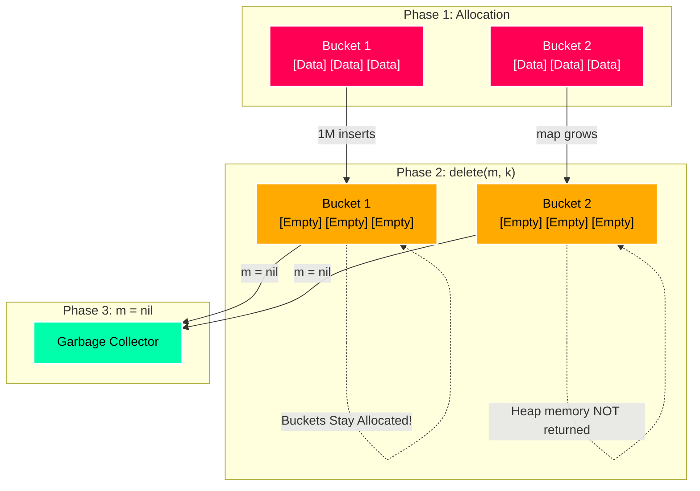

<div align="center">

[](https://go.dev/)
[](https://github.com/takumaniwa/go-map-does-not-shrink)
[](LICENSE)

</div>

# 💀 Go Map Memory: The Ghost in the Heap

> "Why is my RAM eating my k8s pod budget?" — You, probably, at 3 AM.

Welcome to the **modern catalog of Go map memory quirks**. If you think `delete(m, k)` frees memory, you are living in a lie. This repo demonstrates why huge Go maps don't shrink and how to *actually* kill the memory ghost.

---

## The Trap

In Go, **Maps grow, but they don't shrink.**

When you delete 1 million keys from a `map[int]HugeStruct`:

1. The **keys/values are technically zeroed** (sort of).
2. The **buckets (hash slots) remain allocated**.
3. The **Sys Memory** (memory requested from OS) stays high.

### Visualized



---

## Verified on Linux (Ubuntu 22.04)

We ran these benchmarks on a fresh Ubuntu VM to confirm the behavior.

### Environment

- **OS**: Ubuntu 22.04 LTS (Multipass VM)
- **Go**: 1.25.6
- **Memory**: 2GB

### Real World Results

|   Strategy    |       Action       | OS Memory Released? |                             Notes                             |
| :-----------: | :----------------: | :-----------------: | :-----------------------------------------------------------: |
| **Pattern A** |   `delete(m, k)`   |        ❌ NO        |         `Sys` stays at ~1.1GB. Buckets are not freed.         |
|   **Fix 1**   | `m = nil` + `make` |    ⚠️ DELAYED     | `HeapInuse` drops, but `Sys` stays high until Scavenger runs. |
|   **Fix 2**   |  Copy to new map   |    ⚠️ DELAYED     |   Effective for resizing, but release to OS is still lazy.    |
|   **Fix 3**   |  `FreeOSMemory()`  |     🚀 **YES**     |  Forces release. `HeapReleased` spikes to ~1GB immediately.   |

#### ❌ Pattern A (The Leak)

Even after deleting 1 million items, the **System Memory (Sys)** remains high.

```text
[After Adding 1M Items ] Alloc: 1036 MB | Sys: 1087 MB
[After Deleting All    ] Alloc:   36 MB | Sys: 1087 MB | HeapReleased: 0 MB
```

> **Verdict**: The OS still thinks we are using **1.1 GB**.

#### ✅ Fix 3 (The Nuclear Option)

After calling `debug.FreeOSMemory()`, the `HeapReleased` metric spikes, properly returning memory to the OS.

```text
[After GC (Before Free)  ] Sys: 1087 MB | HeapReleased:    0 MB
[After debug.FreeOSMemory] Sys: 1087 MB | HeapReleased: 1056 MB
```

> **Verdict**: **1.05 GB** returned to the OS immediately.

---

## Try It Yourself

Clone this repo and run the experiments. Don't trust me, trust your `top` command.

### 1. The "Naive" Delete (Memory Leak-ish)

```bash
go run pattern_a/main.go
```

*Watch your RAM usage stay high even after "deleting" everything.*

### 2. The Pragmatic Fix (Re-make)

```bash
go run fix1_nil_reset/main.go
```

*Good for logic, but might not satisfy the OS immediately.*

### 3. The Nuclear Solution (FreeOSMemory)

```bash
go run fix3_free_os/main.go
```

*Witness the satisfying drop in memory usage as we force the OS to take it back.*

### Reproduce with Multipass

Want to verify this on your Mac without Docker? Use [Multipass](https://multipass.run/).

```bash
# 1. Launch a Ubuntu VM (2GB RAM required)
multipass launch --name go-map-test --memory 2G 22.04

# 2. Mount this repo
multipass mount . go-map-test:/home/ubuntu/app

# 3. Install Go
multipass exec go-map-test -- sudo snap install go --classic

# 4. Run the Benchmarks
multipass exec go-map-test -- /snap/bin/go run /home/ubuntu/app/pattern_a/main.go
multipass exec go-map-test -- /snap/bin/go run /home/ubuntu/app/fix1_nil_reset/main.go
multipass exec go-map-test -- /snap/bin/go run /home/ubuntu/app/fix2_eviction/main.go
multipass exec go-map-test -- /snap/bin/go run /home/ubuntu/app/fix3_free_os/main.go
```

---

## Directory Structure

| Folder                                | Description                              |
| :------------------------------------ | :--------------------------------------- |
| [`pattern_a/`](./pattern_a)           | The "common mistake" (using `delete`).   |
| [`fix1_nil_reset/`](./fix1_nil_reset) | The pragmatic fix (resetting the map).   |
| [`fix2_eviction/`](./fix2_eviction)   | The resizing fix (copying to a new map). |
| [`fix3_free_os/`](./fix3_free_os)     | The aggressive fix (forcing OS release). |
| [`rss_test/`](./rss_test)             | Scripts to measure RSS from the outside. |
